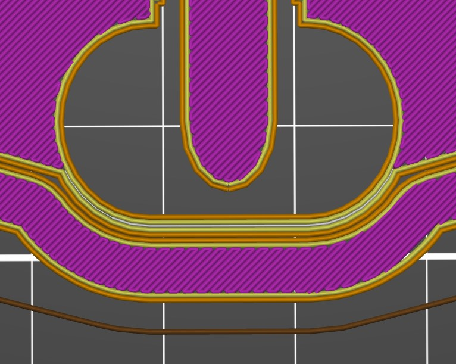
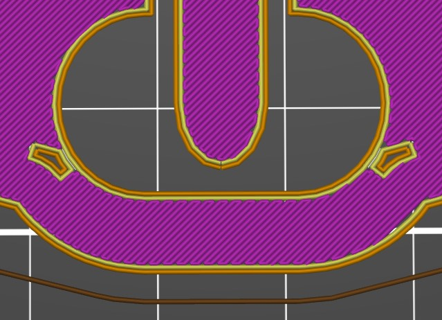
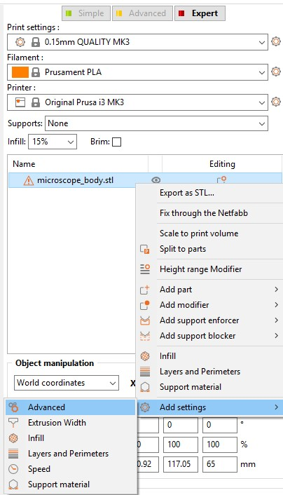
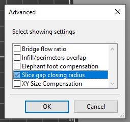
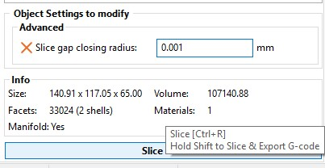

# Printing the plastic parts

First, you will need to print or obtain the 3D printed parts.  These have been designed with some care to print reliably on most RepRap-style printers, using regular PLA filament without support material.  It's important to read through the notes before, as there are multiple versions of the STL files to choose from, so it's not a good idea just to pick all the parts in the folder.  The printed parts are described in their own pages, with details of how to pick the version of that part, for the parts with multiple versions.

The best way to obtain these files is from the [microscope STL configurator] page.

[microscope STL configurator]: https://microscope-stls.openflexure.org

## Standard builds of the microscope

If you just want to build a standard version of the microscope please check print the files in the sections "Webcam-based microscope" or "High resolution microscope". A more extensive list of all available parts is at the bottom of this page if you are customising the microscope.

### Webcam-based microscope

The basic version of the microscope uses a webcam lens instead of a microscope objective - you still get a really nice focusing/sample translation stage, but with basic options.  This version is great for school or hobby use, gets a resolution of about 2um or better, and is the cheapest to build.  This is the version we usually build at workshops.  For each microscope, you will need to print one copy of each of the following files:

**Plastic tools:**

* [band and nut insertion tools, with band tool holder](./parts/printed_tools/actuator_assembly_tools.md) ``actuator_assembly_tools.stl``
* [optional] ``picamera_2_lens_gripper.stl`` (only needed if your camera didn't come with a tool to remove the lens)

**Components:**

* [body of the microscope](./parts/printed/main_body.md): ``main_body_LS65-M.stl`` or ``main_body_LS65-M_brim.stl``.
* 3 [feet](./parts/printed/feet.md): ``feet.stl`` or ``feet_tall.stl`` (contains all 3)
* 3 [large gears](./parts/printed/gears.md): ``gears.stl`` (contains all 3)
* illumination:
  * [vertical dovetail](./parts/printed/illumination_dovetail.md): ``illumination_dovetail.stl``
  * [condenser arm](./parts/printed/condenser.md): ``condenser.stl``
* 2 [sample clips](./parts/printed/sample_clips.md): ``sample_clips.stl`` (contains both)
* platform-style optics module (two parts, best with webcam lenses):
  * [camera platform](./parts/printed/camera_platform.md): ``camera_platform_<camera>_<stage size><height>.stl``
  * [lens spacer](./parts/printed/lens_spacer.md): ``lens_spacer_<camera>_<lens>_<stage_size><height>.stl`` - **Print this in black!**
* [microscope stand](./parts/printed/microscope_stand.md) or back foot
  * ``microscope_stand_no_pi_.stl`` or ``microscope_stand-30.stl`` (holds Raspberry Pi) or ``back_foot.stl``

This will need the nuts, bolts, etc. described on [the bill of materials page](./0_bill_of_materials.md), plus a camera module (for example a Raspberry Pi camera), and an option Raspberry Pi.  No other optical bits are required, except an LED for illumination.

If you want to mount a Raspberry Pi underneath the microscope (our preferred option), print ``microscope_stand.stl`` instead.  If your Raspberry Pi is in a case already, you should print ``back_foot.stl`` so the microscope sits flat on a table.  Newer Raspberry Pi camera modules include a white circular tool for unscrewing the lens.  If you don't have one, you will need to print the lens gripper (marked as optional).

### High resolution microscope

The version of the microscope used for scientific or medical research generally requires a conventional objective lens.  Most of the parts are the same, but the optics and sample mount are different.  You will need one copy of each of the following files:

**Plastic tools:**

* [band and nut insertion tools, with band tool holder](./parts/printed_tools/actuator_assembly_tools.md) ``actuator_assembly_tools.stl``
* [tool to insert](./parts/printed_tools/lens_tool.md) the 13mm diameter condenser lens and/or tube lens: ``lens_tool.stl``
* [optional] ``picamera_2_lens_gripper.stl`` (only needed if your camera didn't come with a tool to remove the lens)

**Components:**

* [body of the microscope](./parts/printed/main_body.md) (beamsplitter-compatible): ``main_body_LS65-M-BS.stl`` or ``main_body_LS65-M-BS_brim.stl``.
* 3 [feet](./parts/printed/feet.md): ``feet.stl`` or ``feet_tall.stl`` (contains all 3)
* 3 [large gears](./parts/printed/gears.md): ``gears.stl`` (contains all 3)
* illumination:
  * [vertical dovetail](./parts/printed/illumination_dovetail.md): ``illumination_dovetail.stl``
  * [condenser arm](./parts/printed/condenser.md): ``condenser.stl``
* 2 [sample clips](./parts/printed/sample_clips.md): ``sample_clips.stl`` (contains both)
* [optics module](./parts/printed/optics_module_casing.md):
  * ``optics_picamera_2_rms_f50d13.stl`` (transmission illumination) **Print this in black!**
  * ``optics_picamera_2_rms_f50d13_beamsplitter.stl`` (reflection illumination) **Print this in black!**
* [microscope stand](./parts/printed/microscope_stand.md): ``microscope_stand-30.stl`` or ``microscope_stand-30-BS.stl`` (supports reflection illumination)
* [riser for the sample](./parts/printed/sample_riser.md):  ``sample_riser_LS10.stl`` (assuming you have a microscope objective with a 45mm parfocal distance)

**For motorised operation you will also need:**

* 3 [small gears](./parts/printed/small_gears.md) for motors: ``small_gears.stl`` (contains all 3)
* [base to hold the motor driver](./parts/printed/motor_driver_case.md) (fits under the base that holds the Pi): ``motor_driver_case.stl``

**For reflection illumination you will also need:**

* [filter cube](./parts/printed/fl_cube.md): ``fl_cube.stl``
* [reflection illuminator](./parts/printed/reflection_illuminator.md): ``reflection_illuminator.stl``

**Additionally, you will need:**

* an RMS threaded, finite-conjugates [objective lens](parts/optics/objective.md).  These can be obtained from e.g. AliExpress.  Depending on whether it is 35mm or 45mm from the "shoulder" of the lens to the sample, you may or may not need the sample riser.  We almost always use 45mm "plan" corrected lenses, which do require the riser.
* a 12.7mm diameter, 50mm focal length [achromatic lens](parts/optics/tube_lens.md), e.g. ThorLabs ac127-050-a or generic equivalent.
* a 13mm diameter, 5mm focal length PMMA plano convex lens for the [condenser lens](parts/optics/condenser_lens.md) (sold as LED lenses in bulk)
* [motors](./parts/electronics/stepper_motors.md) and [motor driver electronics](6_motor_controllers.md)

## Print settings

I usually print using PLA filament with a layer size of 0.2mm, on either a Prusa i3 MK3 or an Ultimaker 2+, which takes 10 hours for the main body.  "low" quality on an Ultimaker 2 (0.15mm layers) produces similar results in about 12 hours.  Sometimes we use 0.3mm layers if we want to go even faster (8 hours or less) on our Prusa - this is unreliable on the Ultimaker.  You should be able to use pretty much any fused filament fabrication printer (i.e. any of the printers that use PLA filament).

> **Warning:** The microscope is designed to print without support material.  If you use support material it will require a lot of cleaning up, and you may well damage the parts.

The main body is designed to print without support material or adhesion layer.  If you do use an adhesion layer, many of the moving parts can be rendered useless by a brim on the main body.  It's possible to remove the brim with a craft knife, but it's very easy to damage the mechanism while doing so.  See below for our "smart brim" which should stick better to the print bed, while also being easier to remove.  This brim does a better job of not fouling the mechanism than most slicers, and is a good option if the part won't stick without a brim - see the next section.  Most of the other parts are possible to clean up after printing with a brim, so you may wish to use one, particularly for the smaller parts like sample clips.

  There are no cantilevered parts that really need support, but there are a few bridges; it might be a good idea to print the ``just_leg_test.stl`` file first, to make sure your printer can print them.  Using support material is likely to be a problem, as it will end up in places where it's hard to remove, and you are very likely to damage the mechanism while removing it.

If your printer has a standard-sized bed (180mmx180mm should be fine) then it should be possible to print the complete microscope in one go, with the exception of the bases that hold the electronics.  I do this if I'm using a machine that is well calibrated and reliable.  However, I find that it's often more reliable to print in batches (as small parts at the edge of the print bed can detach and cause it to fail).  If I need to use a brim, we generally print the main body separately using the "smart brim" and the other small parts in a separate run.  I would recommend:

There is a test file that prints a single leg of the microscope - ``just_leg_test.stl``. It's worth printing this first to check your settings are OK.

The optics module needs to print with some fine detail, so the dovetail meshes nicely with the stage.  A good way to ensure this is to print it at the same time as other parts - either print more than one optics module at a time, or print it at the same time as the microscope body.  This slows down the time for each layer, and means the plastic can cool more completely before the layer on top is deposited, resulting in a higher-quality part.  The optics module is best printed in black to cut down on stray light inside the tube - though it will still work in other colours.

## Smart Brim

For the majority of printed parts, your printer's slicer program will be able to automatically add a suitable brim to the print to improve adhesion. The exception to this is the main body, where an automatic brim is likely to fill gaps required for the movement of the sample.

This smart brim automatically determines areas suitable for a brim to be added, and adds the brim to the STL file. As the brim is part of the STL it isn't always easy to remove. Rather than simply extending the lowest layer, the smart brim edge is a seperate part printed parallel to the edge of the part being printed, making clean up significantly easier.

Sometimes slicers automatically combine the brim and the part. You can check this hasn't happened in your slicer software after slicing by previewing the lowest layer; the edges of the smart brim should appear parallel as shown below (edges of the part and brim are shown in orange).

Regardless of your printer, when printing the microscope do not attempt to add a further brim in the slicer. Some example slicer settings required for a smart brim in different slicers are listed below.

*   **Ultimaker Cura**

Cura (v4.4) automatically slices the smarter brim suitably for printing.

*   **PrusaSlicer**

As shown below, without changing the default settings in PrusaSlicer (v2.1.1), the smart brim would be printed as an extension of the microscope base.

This can be corrected in the "Expert" tab of PrusaSlicer. Right click on the part(s) requiring a smart brim, and open the Add settings > Advanced menu. Check the "Slice gap closing radius" box and click OK.

This will open a slice gap closing radius option, which should be set to 0.001 mm. This will add the option to re-slice the model, which will now print the brim as required.

## Clean-up of printed parts
If you printed the parts yourself, start by opening out the three holes in the microscope body with a drill as shown.  Make sure to go all the way through.  If you don't have a drill, you can improvise by screwing in an M3 screw all the way, then forcibly rotating it with a screwdriver or the supplied nut.  Also, remove any loose strings of plastic from the underside of the sample stage, using a pair of pliers. The last step shouldn't be necessary if your machine is calibrated nicely for printing bridges.

There are also ties between the actuator column casing and the central actuator column that holds the brass nut - these need to be snapped, as described in the instructions later on.  There may also be short ties between the two thinner pairs of legs and the "wall" running around the microscope - these should also be snapped with a knife.  The "ladder" like structure between each pair of legs is also only there for support during printing - it does no harm to leave it in place, but if you cut the "rungs" out, it will allow the stage to move a little more freely.

Once you have your printed parts, you can start by [assembling the actuators](./1_actuator_assembly.md).

## Extra details for custom microscopes

You can safely ignore this section if you are building one of the two standard builds listed above. If you are building a customized versions and need to understand all of your options, read on.

**Plastic tools:**
* [band and nut insertion tools, with band tool holder](./parts/printed_tools/actuator_assembly_tools.md) ``actuator_assembly_tools.stl``
* [tool to insert](./parts/printed_tools/lens_tool.md) the 13mm diameter condenser lens and/or tube lens: ``lens_tool.stl``
* [jig to hold the camera board](./parts/printed_tools/picamera_2_tools.md) while you unscrew the lens ``picamera_2_gripper.stl``
* [optional] [tool to unscrew the camera's lens](./parts/printed_tools/picamera_2_tools.md) (only needed if your camera didn't come with one) ``picamera_2_lens_gripper.stl``

**Components:**
* [body of the microscope](./parts/printed/main_body.md): ``main_body_<stage size><height>[-M].stl``.
* 3 [feet](./parts/printed/feet.md): ``feet.stl`` or ``feet_tall.stl`` (contains all 3)
* 3 [large gears](./parts/printed/gears.md): ``gears.stl`` (contains all 3)
* illumination:
 - [vertical dovetail](./parts/printed/illumination_dovetail.md): ``illumination_dovetail.stl``
 - [condenser arm](./parts/printed/condenser.md): ``condenser.stl``
* 2 [sample clips](./parts/printed/sample_clips.md): ``sample_clips.stl`` (contains both)
* optics module (you need one of the two options below):
 - old-style [optics module](./parts/printed/optics_module_casing.md) (one part, best with RMS objectives): ``optics_<camera>_<lens>_<stage size><height>.stl``
 - platform-style optics module (two parts, best with webcam lenses):
  * [camera platform](./parts/printed/camera_platform.md): ``camera_platform_<camera>_<stage size><height>.stl``
  * [lens spacer](./parts/printed/lens_spacer.md): ``lens_spacer_<camera>_<lens>_<stage_size><height>.stl``
* [optional] camera cover: ``picamera_2_cover.stl``
* [optional] 3 [small gears](./parts/printed/small_gears.md) for motors: ``small_gears.stl`` (contains all 3)
* [optional] [riser for the sample](./parts/printed/sample_riser.md): ``sample_riser_<stage size><thickness>.stl``
* [optional] slide holder that works better if using immersion oil: ``slide_riser_LS10.stl``
* [optional] [base to hold a Raspberry Pi](./parts/printed/microscope_stand.md): ``microscope_stand.stl``
* [optional] [base to hold the motor driver](./parts/printed/motor_driver_case.md) (fits under the base that holds the Pi): ``motor_driver_case.stl``
* [optional] [back foot](./parts/printed/back_foot.md), in case you are not using the microscope stand: ``back_foot.stl``

In the filenames above, where there are multiple versions, parameters are included in angle brackets:
* ``<stage size>`` selects the size of the platform - but currently only ``LS`` is supported.
* ``<height>`` is the height from the bottom of the main body to the top of the stage in mm, currently either ``65`` or ``75``.
* Usually the above two parameters occur next to each other, so you will see ``LS65``.  I pretty much only use ``65`` as standard, and if I am using an objective (which is the norm) I add a 10mm riser.
* ``<camera>`` is the camera you are using, either ``picamera_2`` for the Raspberry Pi camera module v2, ``c270`` for the Logitech C270, or ``m12`` for a camera with a screw-on M12 lens mount.
* ``<lens>`` is the lens you are using, either ``pilens``, ``c270_lens``, or ``m12_lens`` if you are using the lens that came with your camera.  To use a finite-conjugate, RMS threaded objective lens, you should specify ``rms_f50d13`` (for a 50mm focal length, 12.7mm diameter tube lens, e.g. ThorLabs ac127-050-a).  You can also specify ``rms_f40d16`` (to use a Comar tube lens, focal length 40mm, diameter 16mm) but this is deprecated as the images weren't as good.
* ``<thickness>`` is the thickness of a stage riser - the amount it adds to the height.  Usually a 10mm riser is used with a 65mm body to allow a 45mm parfocal distance objective to be used, currently only LS10 is reccommended.
Optional bits of filenames are in square brackets above:
* ``-M`` in the body name means it has motor lugs to allow 28BYJ-48 stepper motors to be fitted
* ``_tall`` on the illumination or the feet means the body sits 26mm off the ground rather than 15mm, to give clearance for larger camera modules.  This is only useful if you are not using the microscope stand.

Currently, there are two reccommended versions of the body; ``LS65`` and ``LS65-M``.  The only difference is that the ``-M`` version can be fitted with motors.  To build the high-resolution version of the microscope, use the 10mm thick sample riser ``sample_riser_LS10.stl``, and ``optics_picamera_2_rms_f50d13_LS65.stl``.  To build the low-resolution version, don't use the sample riser, and instead use ``camera_platform_picamera_2_LS65.stl`` and ``lens_spacer_picamera_2_pilens_LS65.stl``.  In both cases, it's best to print the microscope stand, and use the standard-height feet.

**Printable elastic bands**
If you are not able to get hold of Viton O rings, one possible alternative is to print some O rings using flexible TPU filament.  The STL file to use for this is ``actuator_tension_band.stl``.  More details are given in the [part page for O rings](./parts/fixings/viton_o_ring_30mm_inner_diameter_2mm_cross_section.md).
