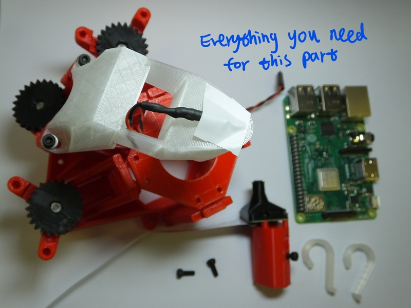
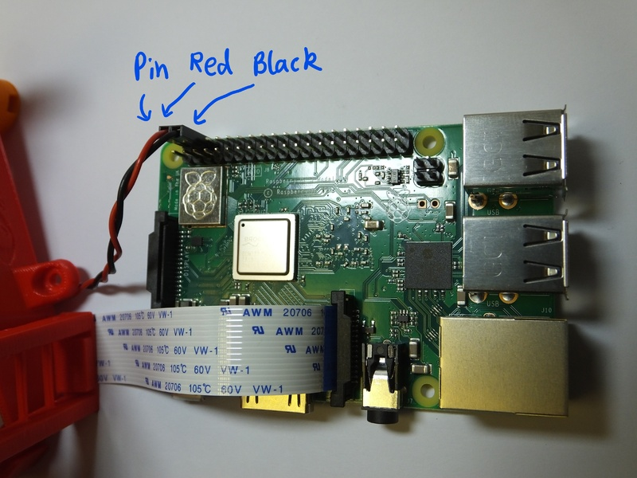
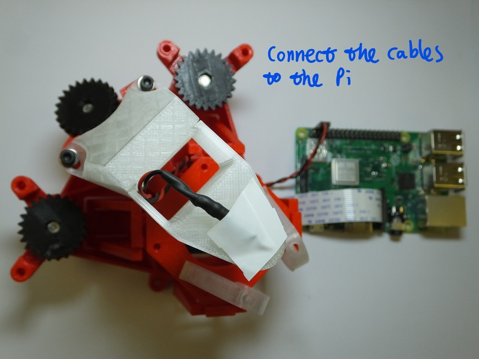
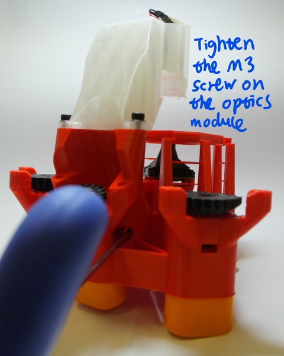
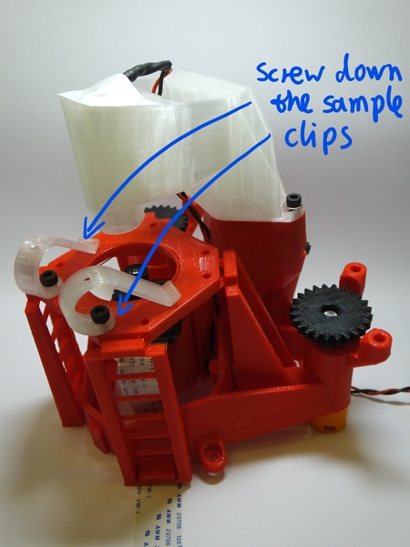
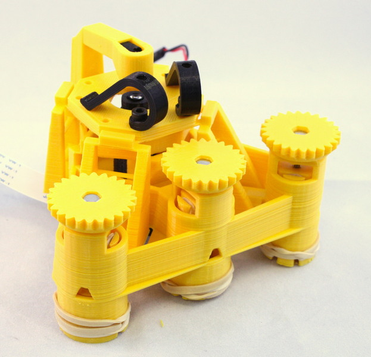
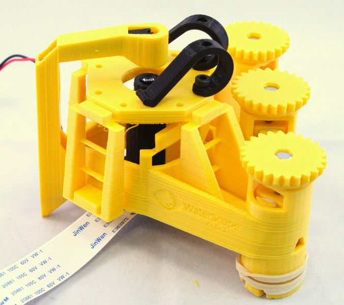
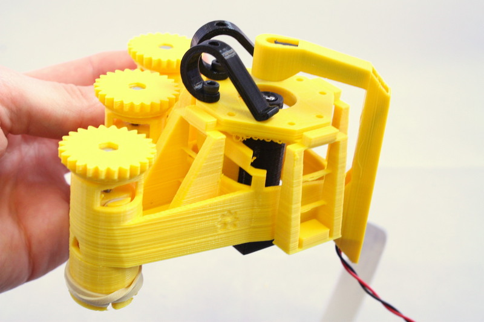
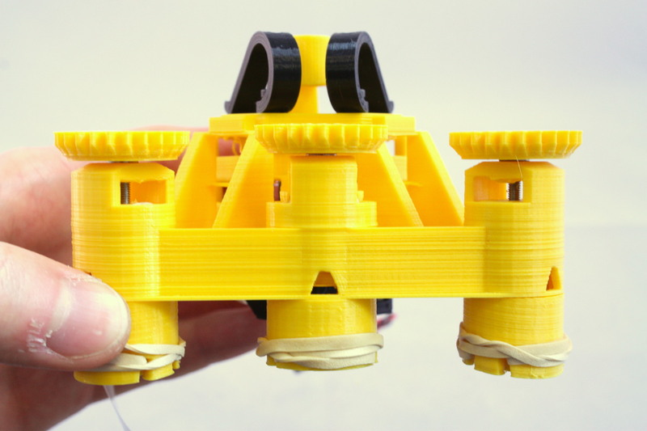

# Sample mounting and wiring

# Requirements
All the parts you need are shown below:

## Parts
*   1 Microscope body, with 3 assembled actuators, an optics module, and the illumination attached.
*   2 [M3x8mm screws](./parts/m3x8mm_screws)
*   2 [Sample clips](./parts/sample_clips)
*   1 [Raspberry Pi](./parts/raspberry_pi)

## Tools
*   A 2.5mm ball-ended hex key

# Assembly Instructions
## Step 1
Plug the LED cable into the GPIO connector on the Raspberry Pi, to the 0v and 5v lines.  These are the second and third pins from the top of the connector, on the outside edge - pins number 4 and 6.

Plug in the camera to the camera connector as described in the [Raspberry Pi learning materials](https://projects.raspberrypi.org/en/projects/getting-started-with-picamera) (the connector is next to the Ethernet port, and the contacts on the cable face the port, i.e. they face away from the tab on the plug).

## Step 2
If you are using a tall optics module, e.g. if you are using a plan corrected objective, you may need to fit a [sample riser](./parts/printed/sample_riser.md) between the microscope body and the microscope slide.  This is not necessary if you are using the basic optics module.

## Step 3
Fit the optics module onto the microscope - it slides in from the bottom as shown.  The screw sticking out the side fits into the "keyhole" shaped slot in the microscope body.

## Step 4
Tighten the screw to hold the optics module in place.  You can reach the screw with a ball-ended hex key, through the hole near the Z axis, as shown below:

## Step 3
After this, there are only the sample clips to go.  Exactly where you place these will depend on the samples you intend to use, but in any case you simply push the M3 screws into the clips, then screw down into the holes on the stage.

## Step 4
Your microscope is now complete - happy observing!
You might want to consult the [camera module documentation](http://www.raspberrypi.org/documentation/usage/camera/) or [raspicam documentation](http://www.raspberrypi.org/documentation/usage/camera/raspicam/README.md) if you need a hand setting up the camera.

