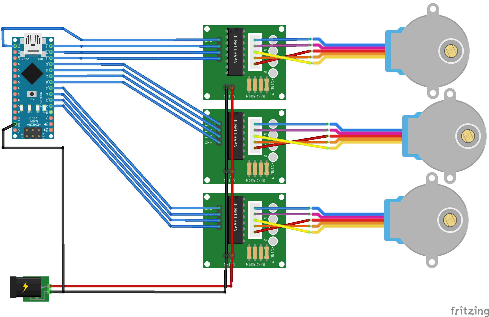

# Motor controller boards

The motorised version of the microscope uses a motor controller based on an Arduino and some very simple Darlington pair driver chips.  There are several options for how to build this, which should all work equally well.  In all cases, you need to upload the [Sangaboard arduino sketch] using the Arduino IDE.  There are a few issues that crop up quite frequently, and we have highlighted these below:

* **Power supply:** there are 5 Volt and 12 Volt versions of the 28BYJ-48 motors.  You should use a power supply that matches your motors.  As we use very simple drivers, if you use too high a voltage the motors will overheat. If in doubt, start with 5V.
* **Arduino IDE:** Some users have found issues with old (or very new) versions of the Arduino IDE not working properly.  See the [issue thread on motor boards not working](https://gitlab.com/openflexure/openflexure-helpdesk/-/issues/12#note_342049911) for more details.
* **Arduino Clones:** Many people use Nano boards not made by Arduino.  These often come with cheaper USB to serial ICs (which require drivers - see the Arduino section at the end of this page) and old bootloaders (which require different options in the Arduino IDE).  This is also discussed in the [issue thread on motor boards not working].

[issue thread on motor boards not working]: https://gitlab.com/openflexure/openflexure-helpdesk/-/issues/12#note_342049911

Three "official" designs for the Sangaboard exist, and these are described below.

## Board designs

### Simple controller using Arduino Nano

Most recommended [motors](./5_motors.md) will come packaged with a simple driver board. These can be connected to an Arduino Nano and a power supply following the diagram below.

The motor order is x-motor, y-motor, z-motor from top to bottom of this diagram. Since the driver board accepts 5v-12v, You can power it with a 5v power supply, which can be easily made from a USB cable with a USB charger. Cut open a USB cable, connect the Vcc wire (usually the red wire) to the positive pins, and the GND wire (usually the black wire) to the negative pins, confirm you have the right wires using a multimeter. You can then power it with a USB charger.

Then, use the Arduino IDE to upload the [Sangaboard arduino sketch], and connect the Arduino to your microscope's Raspberry Pi via its USB port.

> **Warning:** Do not attempt to power the motors from the Raspberry Pi's pins. They can draw far more than the maximum current the Pi will safely supply. Always use a separate power supply for the motors.

When you boot up the Raspberry Pi, the microscope software should recognise a supported Sangaboard is connected, and enable motorised control of the microscope stage.  It should be detected as a Sangaboard v0.2; as far as the microcontroller is concerned, this option and the next one are identical.

NB the diagram above shows the wires crossing over between the motors and the connectors - this is just due to the order of the wires on the two components in Fritzing; there is no need to modify the wiring between your motor and the driver board.

[Sangaboard arduino sketch]: https://gitlab.com/bath_open_instrumentation_group/sangaboard/tree/master/arduino_code

### PCB + Arduino Nano (Sangaboard v0.2)

This option aims to be a super-simple motor controller board, based on an Arduino Nano and a couple of Darlington pair ICs. Electrically, it is more or less identical to the previous option, but replaces the messy wiring with a PCB.  It owes quite a bit to [Fergus Riche's motor board](https://github.com/fr293/motor_board), the hardware developed by [OpenScope](http://2015.igem.org/Team:Cambridge-JIC) and the Arduino-based motor controller used by a number of summer students working with Richard Bowman in Cambridge, particularly James Sharkey.

The PCB design, bill of materials, and purchase links for both are available via [Kitspace](https://kitspace.org/boards/github.com/rwb27/openflexure_nano_motor_controller/).  You can see an image of the [circuit schematic](./images/sangaboard_v2_schematic.png ':ignore')

### Fully integrated board (Sangaboard v0.3)

A fully-custom, Arduino-like board can also be used to drive the microscope motors. The Sangabord v0.3 design integrates everything onto a single PCB, removing the need to plug in a separate Arduino.  It uses the same Arduino sketch as the other options, but the Arduino is now integrated into the PCB.  This is easier to use if you are having boards made externally.

The PCB design, bill of materials, and purchase links for both are also available via [Kitspace](https://kitspace.org/boards/gitlab.com/bath_open_instrumentation_group/sangaboard/).

If building or ordering your own custom board, you will first need to burn the [custom bootloader], before uploading the [Sangaboard arduino sketch].

[custom bootloader]: https://gitlab.com/bath_open_instrumentation_group/sangaboard/blob/master/Bootloader/README.md

## Arduino code

All of the motor board options are Arduino-compatible, and use the same [Sangaboard arduino sketch].  This is referred to as the "firmware" in various places.  If you are using a purchased Arduino, it should have a bootloader on it already, so all you need to do is upload the sketch, and you should be good to go.

> **N.B.** some people have reported that the sketch won't upload properly to cheap Arduino Nano clones.  There are a couple of issues here - firstly, you may need to install USB-to-serial drivers for the CH340 chip used in these clones (the FTDI chip used by genuine Arduinos has drivers built in to Windows, the cheaper chips don't).  Secondly, if you are using a new version of the Arduino IDE, you may need to select the "old bootloader" option (in the board menu where you select the processor).

If you are using one of the boards with an integrated microcontroller rather than a discrete Arduino Nano board, your microcontroller may not come with a preinstalled bootloader.  You must flash either the Arduino bootloader, or our [custom bootloader].  The [custom bootloader] makes the motor board show up as a "Sangaboard" rather than an Arduino, but it is otherwise identical to the Arduino bootloader.
